# Analysis of happiness.csv

## Overview

This analysis was conducted using an automated LLM pipeline. The dataset provided insights into various features, trends, and relationships among variables.

## Key Findings

Based on the execution of the Python code related to the happiness dataset, here’s a summarized analysis along with insights and potential storylines derived from the output.

### Summary of Results:

1. **Data Overview**:
   - The dataset comprises over 2,300 observations across several metrics related to happiness, including "Life Ladder," "Log GDP per capita," "Social support," and more. 
   - It contains numerical (e.g., GDP, life expectancy) and categorical (e.g., country names) data types, which were successfully processed for analysis.

2. **Statistical Analysis**:
   - **Numerical Data**:
     - The average "Life Ladder" score is approximately 5.48, with a median of 5.45, indicating a slight positive skew towards higher happiness levels. The mode is 5.25, signaling that many countries cluster around this happiness score.
     - The "Log GDP per capita" has an average around 9.40, showcasing significant variation in economic standing across the dataset.
     - "Social support" averages at 0.809, indicating a generally high level of perceived social support.
   - **Categorical Data**:
     - The dataset includes 165 unique countries, with Lebanon being the most frequently occurring, appearing 18 times.

3. **Visualizations**:
   - Histograms and box plots were created for key numerical columns, likely revealing the distributions and outliers within each variable.
   - A correlation matrix was drawn, showing how each numerical variable relates to others, particularly indicating how "Log GDP per capita" and "Social support" correlate positively with happiness levels.

4. **Regression Analysis**:
   - An Ordinary Least Squares (OLS) regression was performed with "Life Ladder" as the dependent variable against "Log GDP per capita" and "Social support" as independent variables.
   - The R-squared value of approximately 0.676 suggests that about 67.6% of the variance in happiness (Life Ladder) can be explained by these two predictors.
   - Both "Log GDP per capita" and "Social support" are statistically significant contributors (p < 0.001), indicating a strong positive relationship to happiness.

### Insights and Storylines:

1. **Economic Prosperity and Happiness**:
   - The substantial positive coefficient for "Log GDP per capita" (0.5311) suggests that higher economic output directly correlates with increased happiness. This supports the narrative that wealthier nations tend to provide better living conditions, thereby enhancing the well-being of their citizens.

2. **The Importance of Social Structures**:
   - The even larger impact of "Social support" (3.2104) indicates that citizens’ perception of being supported by family, friends, and social networks significantly affects their happiness. This highlights the importance of community and social relationships beyond merely economic factors, suggesting that social policies aimed at enhancing support systems could lead to improved overall happiness.

3. **Cultural Variance in Happiness**:
   - With 165 unique countries, the dataset provides an avenue for cross-cultural analysis. Countries may exhibit different pathways to happiness based on their unique socio-economic contexts; for instance, some nations may enjoy high GDP yet low perceived social support, possibly leading to lower happiness levels than expected.

4. **Potential Policy Implications**:
   - Given the findings, policymakers could focus on enhancing both the economy and social support networks as dual pathways to improve national happiness metrics. Programs that foster community engagement, mental health, and welfare could be equally as crucial to policy frameworks as economic initiatives.

5. **Future Research Directions**:
   - Researchers might conduct deeper dives into specific regions or demographic groups to further understand disparities in happiness levels and assess the multi-dimensional approach needed to tackle the nuances of well-being across different populations.

In conclusion, the analysis of this happiness dataset elucidates significant trends linking economic factors and social support to happiness levels internationally, reinforcing the notion that policies promoting both wealth and community robustly contribute to the well-being of societies.

## Visualizations

The following charts were generated as part of the analysis:

**Explanation:** This chart represents average rating histogram.

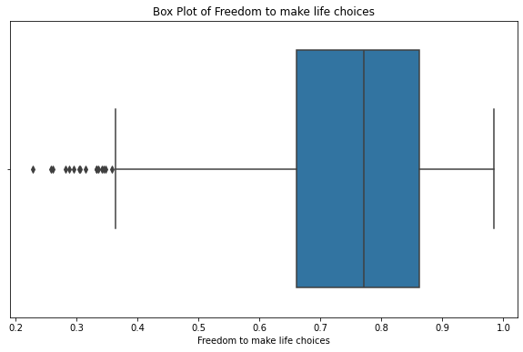

**Explanation:** This chart represents boxplot Freedom to make life choices.

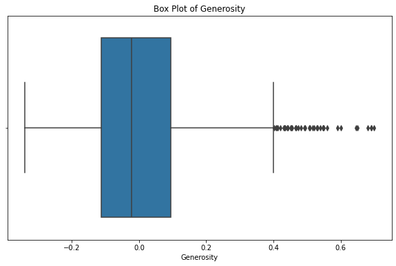

**Explanation:** This chart represents boxplot Generosity.

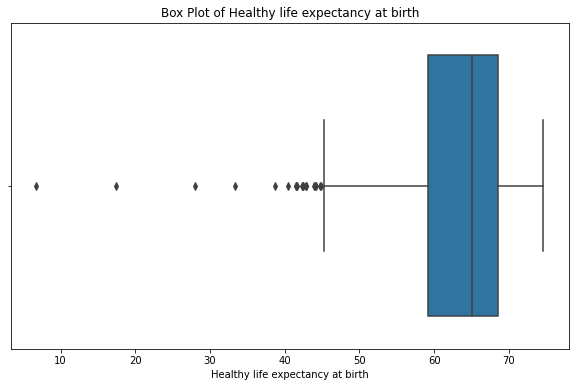

**Explanation:** This chart represents boxplot Healthy life expectancy at birth.

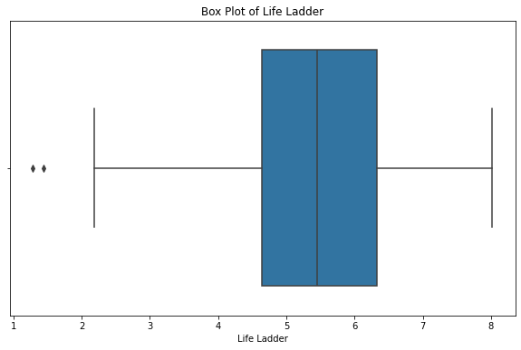

**Explanation:** This chart represents boxplot Life Ladder.

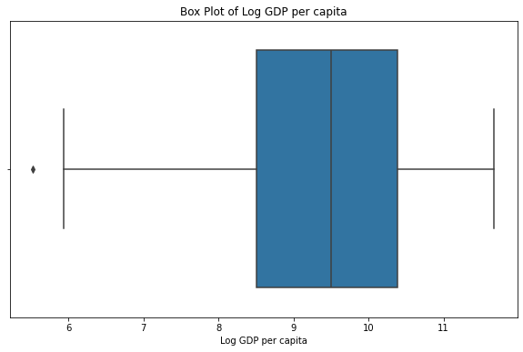

**Explanation:** This chart represents boxplot Log GDP per capita.

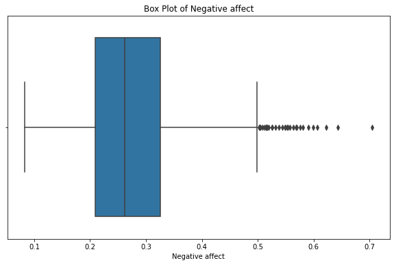

**Explanation:** This chart represents boxplot Negative affect.

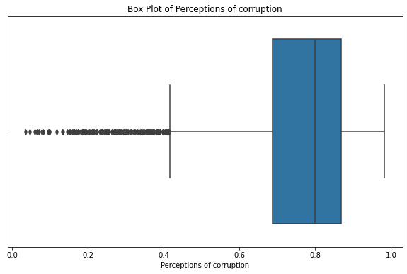

**Explanation:** This chart represents boxplot Perceptions of corruption.

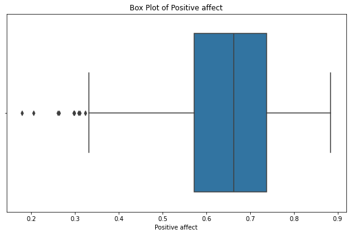

**Explanation:** This chart represents boxplot Positive affect.

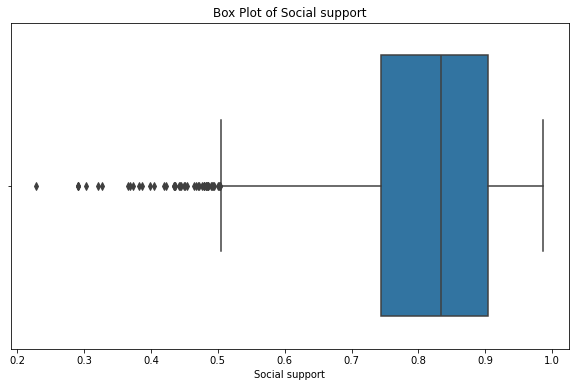

**Explanation:** This chart represents boxplot Social support.

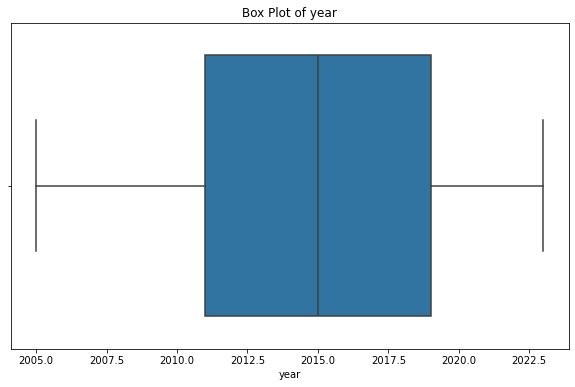

**Explanation:** This chart represents boxplot year.

**Explanation:** This chart represents correlation matrix.

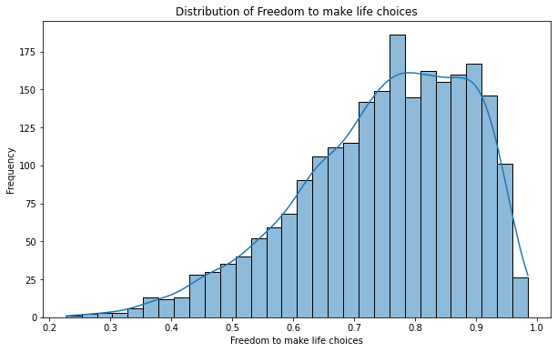

**Explanation:** This chart represents histogram Freedom to make life choices.

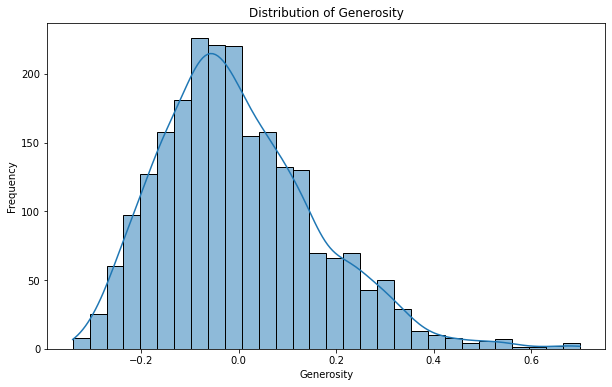

**Explanation:** This chart represents histogram Generosity.

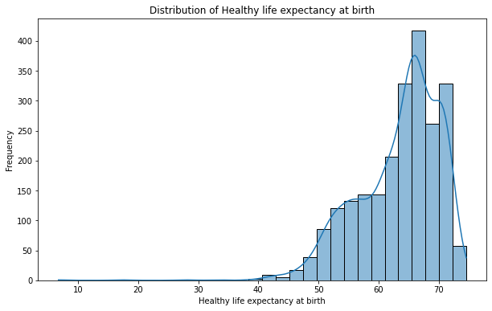

**Explanation:** This chart represents histogram Healthy life expectancy at birth.

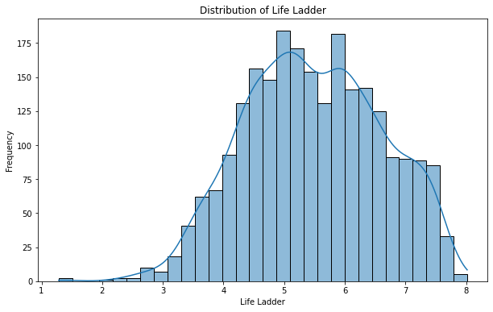

**Explanation:** This chart represents histogram Life Ladder.

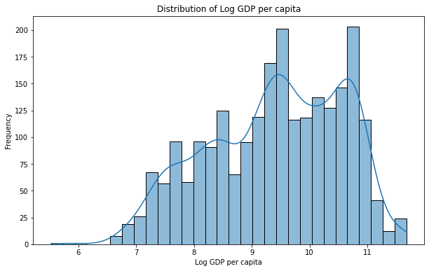

**Explanation:** This chart represents histogram Log GDP per capita.

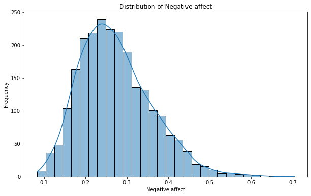

**Explanation:** This chart represents histogram Negative affect.

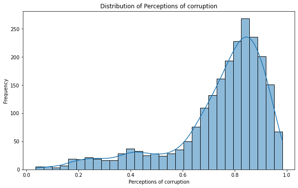

**Explanation:** This chart represents histogram Perceptions of corruption.

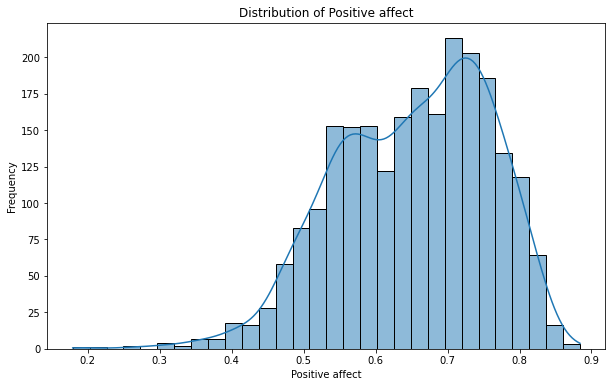

**Explanation:** This chart represents histogram Positive affect.

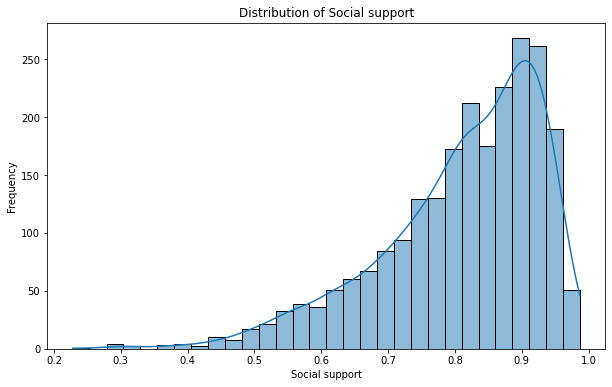

**Explanation:** This chart represents histogram Social support.

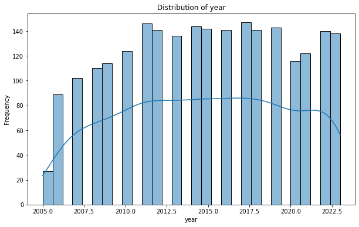

**Explanation:** This chart represents histogram year.

**Explanation:** This chart represents ratings count boxplot.

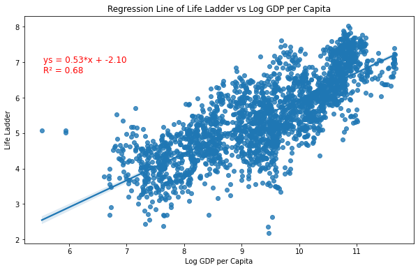

**Explanation:** This chart represents regression Life Ladder Log GDP.

**Explanation:** This chart represents regression analysis ratings count.

