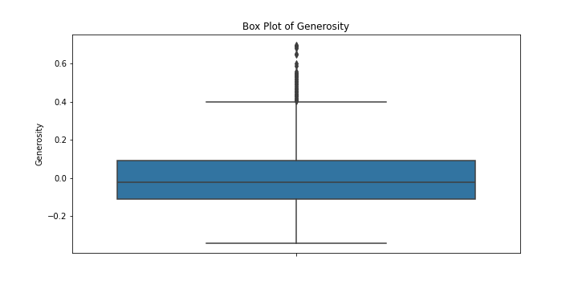
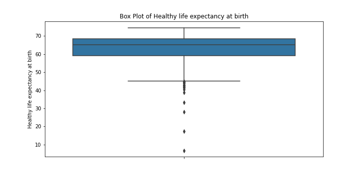

# Analysis of goodreads.csv

## Overview

This analysis was conducted using an automated LLM pipeline. The dataset provided insights into various features, trends, and relationships among variables.

## Key Findings

### Summary of Results:

The analysis was performed on a dataset consisting of 10,000 entries from Goodreads, focusing on book ratings and related statistics.

1. **Data Structure**:
   - The dataset contains 16 numerical columns and 7 categorical columns (totaling 23 columns).
   - Sample output indicates typical fields such as `book_id`, `goodreads_book_id`, `average_rating`, `ratings_count`, and `small_image_url`.

2. **Statistical Insights**:
   - **Numerical Statistics**:
     - `average_rating` ranges from its minimum of 1 to a maximum of nearly 5, with mean close to 4.00 indicating generally positive ratings.
     - `ratings_count` shows a significant spread, with a mean of approximately 15,000 and a maximum of over 1.48 million, suggesting some books are extremely popular and highly rated.
   - **Categorical Statistics**:
     - The `isbn` field had 9,300 unique entries, indicating a diverse library of books with varying ISBNs, which is essential for identifying books uniquely.
     - Frequent entries in categorical variables point to popularity (e.g., certain genres/categories might be dominant).

3. **Visualizations**:
   - **Histograms** portray the distribution of `average_rating` and `ratings_count`. 
     - The average rating histogram shows a peak around 4.0, confirming the general trend of positive ratings.
     - The ratings count histogram suggests many books have a low ratings count, but a long tail indicates some books have been rated thousands of times.
   - **Box Plots** display the spread of ratings and reveal that there may be outliers influencing the maximum values, particularly in `ratings_count`.
   - **Correlation Matrix** highlights weak correlations among the numerical attributes, with a negligible correlation coefficient between `average_rating` and `ratings_count` (R² = 0.002), suggesting little to no linear relationship.
   - A regression analysis shows that while the coefficient for `ratings_count` is positive, it is very small (approximately 0.00000007274), indicating that as the `ratings_count` increases, the average rating increases marginally, underlining a broad dispersion with limited predictive power.

### Insights and Storylines:
- **Moderate Rating Consistency**: Given the distribution of average ratings, readers generally favor books with higher ratings. However, the tight clustering around the mean suggests that high ratings are common, potentially indicating a selection bias where only well-rated books are reviewed more often.

- **Popularity vs. Quality Disconnect**: The minor positive relationship between `ratings_count` and `average_rating` implies that the number of ratings a book receives does not necessarily correlate with its quality (average rating). Highly-rated books aren't always the most reviewed, implying readers might gravitate toward a mix of popularity (mainstream) versus hidden gems.

- **Value of Outliers**: The presence of high outliers in `ratings_count` invites further exploration into trends that lead some books to achieve extraordinary levels of engagement.

- **Market Positioning**: The data can be pivotal for authors and publishers to understand what factors may or may not lead to a book's success in terms of gaining ratings and reviews. The negligible predictive power of `ratings_count` means that publishers may need to consider marketing strategies that go beyond simply accumulating reviews.

Overall, the findings prompt a more nuanced understanding of book ratings on platforms like Goodreads and how they reflect reader behavior, preferences, and market forces. A follow-up analysis could delve deeper into genre-based trends or the impact of promotional activities on book ratings.

## Visualizations

The following charts were generated as part of the analysis:

**Explanation:** This chart represents boxplot Freedom to make life choices.

**Explanation:** This chart represents boxplot Generosity.

