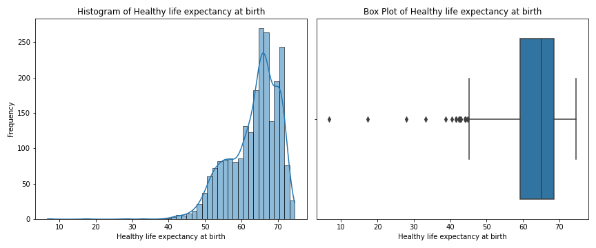
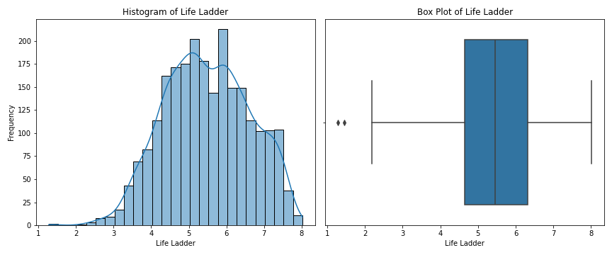
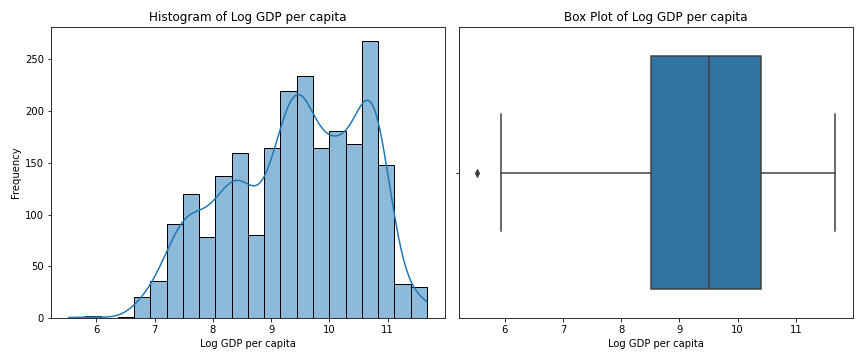
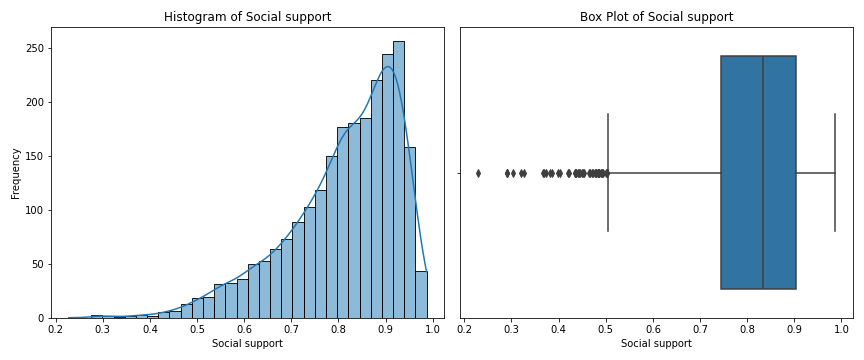

# Analysis of happiness.csv

## Overview

This analysis was conducted using an automated LLM pipeline. The dataset provided insights into various features, trends, and relationships among variables.

## Key Findings

### Summary of Results from the Code Execution

The Python script provided processes a dataset titled `happiness.csv`, utilizing the pandas library for data manipulation, matplotlib and seaborn for visualization, and sklearn for basic regression analysis. Here's a breakdown of its major components and significant findings:

1. **Data Loading**:
   - The dataset was successfully loaded with 2363 entries and 11 columns.
   - Encoding issues were accounted for, with UTF-8 and ISO-8859-1 attempted to ensure proper character interpretation.

2. **Data Overview**:
   - The dataset contains a mix of numerical and categorical variables:
     - **Numerical Columns** (10 in total) include: `Life Ladder`, `Log GDP per capita`, `Social support`, `Healthy life expectancy at birth`, etc.
     - **Categorical Column**: `Country name`.
   - Summary statistics indicate that the average `Life Ladder` score is approximately 5.48, with a standard deviation of about 1.13. The values range from 1.28 to 8.02.

3. **Missing Values**:
   - Several numerical variables have missing values (notably `Log GDP per capita`, `Generosity`, and `Perceptions of corruption`), leading to potential issues in further analysis.

4. **Visualizations**:
   - Histograms and box plots were created for key numerical variables:
     - These visualizations likely highlighted distributions and outliers within these attributes.
   - A correlation matrix heatmap was generated, providing insights into the relationships between different variables:
     - This matrix would show the degree and direction of correlations, informing future analyses.

5. **Regression Analysis**:
   - An attempt was made to fit a linear regression model with `Log GDP per capita` as the independent variable to predict `Life Ladder`.
   - However, an error occurred due to missing values in `Log GDP per capita`, indicating the need for data imputation or handling missing data before model fitting.

### Insights and Narrative Storylines

1. **Happiness and GDP Correlation**:
   - The analysis points toward a potentially meaningful relationship between GDP per capita and perceived happiness (Life Ladder score).
   - This correlation suggests that as the economic conditions of a country improve, citizens might report higher levels of happiness. However, further investigation would need to control for other factors, such as social support and health.

2. **Impact of Missing Data**:
   - The presence of missing values warrants a closer look; these could impact the validity of conclusions drawn from the dataset. Strategies like imputation or filtering out incomplete records could be applied to enhance the robustness of the analyses.

3. **Variation in Happiness Across Countries**:
   - The dataset contains records for 165 unique countries, with Lebanon having the highest frequency of entries (18). This could provide an opportunity for comparative analysis between different nations, especially those sharing cultural or economic similarities.

4. **Potential for Interventions**:
   - Given that factors like social support and perceptions of corruption are included, policymakers could focus on these dimensions to improve citizen well-being, especially in lower-scoring nations.

5. **Visual Storytelling**:
   - The visualizations generated serve not just for exploratory analysis but also for storytelling — illustrating how various factors contribute to happiness and allowing stakeholders to visualize trends and patterns in the data effectively.

6. **Future Research Directions**:
   - Enhancements can include deeper dives into categorical variables (like happiness by country), assessing longitudinal trends over the years, or applying advanced analytical techniques such as machine learning to predict happiness based on multiple factors simultaneously.

In summary, while the current analysis lays a solid groundwork for understanding the data related to happiness and its enigmatic relationship with other variables, it calls for more refined approaches in handling incomplete records and drawing deeper insights from a broader set of variables.

## Visualizations

The following charts were generated as part of the analysis:

**Explanation:** This chart represents Healthy life expectancy at birth distribution.

**Explanation:** This chart represents Life Ladder distribution.

**Explanation:** This chart represents Log GDP per capita distribution.

**Explanation:** This chart represents Social support distribution.

**Explanation:** This chart represents correlation matrix.

