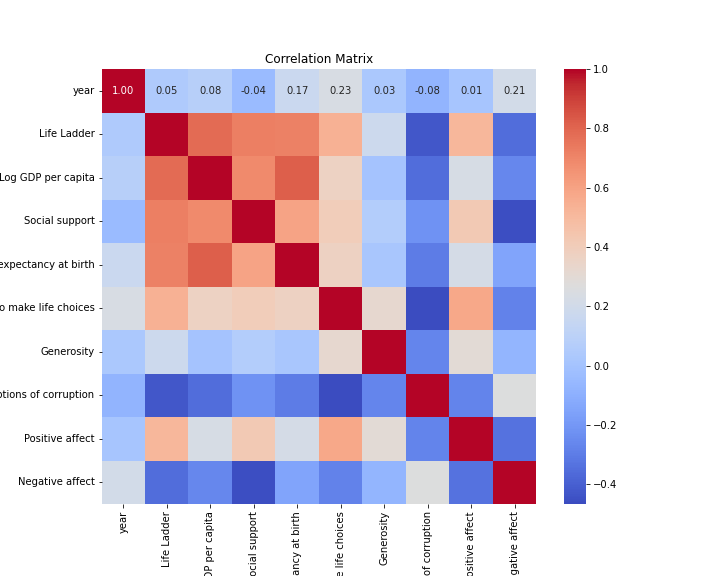

# Analysis of goodreads.csv

## Overview

This analysis was conducted using an automated LLM pipeline. The dataset provided insights into various features, trends, and relationships among variables.

## Key Findings

### Summary of Results and Insights

1. **Data Loading and Shape**: The dataset is successfully loaded, containing 10,000 entries across 23 features. This indicates a reasonably comprehensive dataset for analysis, likely encompassing a wide range of books and their attributes.

2. **Handling of Missing Values**: The script drops rows missing 'isbn' and 'isbn13', which are critical identifiers for books. Missing values in 'original_publication_year' are filled with the median, and missing values in 'language_code' are replaced with 'eng', implying that English is assumed as the default language in the absence of other information.

3. **Statistical Summaries**:
   - **Numerical Statistics**: The cleaned dataset's numerical features have diverse statistics:
     - High mean and standard deviation for 'ratings_count' and 'work_text_reviews_count', indicating that a few books have a significantly higher number of ratings and reviews compared to others.
     - Minimum and maximum values show a considerable range for 'ratings_count', suggesting a wide variance in the popularity of books.
   - **Categorical Mode**: The results show that there are numerous entries with varied ISBNs; however, specific categorical details are not highlighted. A focus on small image URLs indicates that many entries do not have associated images.

4. **Data Visualization and Exploratory Analysis**:
   - Histograms and boxplots of numerical features were generated. These visualizations are expected to reveal distributions, outliers, and the presence of skewness within the data.
   - A correlation matrix was computed, providing insights into the relationships between numerical features. A heatmap can indicate which features are positively or negatively correlated.

5. **Regression Analysis**:
   - A regression model was constructed to predict 'average_rating' based on 'ratings_count' and 'work_text_reviews_count'.
   - The resulting R-squared value of 0.005 indicates that the model explains only 0.5% of the variability in average ratings. Even though the p-values for the predictors are statistically significant, the very low R-squared suggests that other factors may influence book ratings significantly but were not accounted for in the model.
   - The coefficients imply that an increase in 'ratings_count' positively affects average ratings, while an increase in 'work_text_reviews_count' negatively correlates with average ratings. This could suggest that books with more reviews may receive lower average ratings, potentially due to a higher volume of critical reviews compared to praise.

### Insights and Storylines:

1. **Book Popularity Dynamics**: The dataset highlights the disparity in book popularity—some have thousands of ratings while many have very few. This tells the story of a long tail in book popularity, where a small number of books dominate the ratings landscape.

2. **Impact of Reviews on Ratings**: The regression results generate an intriguing narrative regarding how ‘work_text_reviews_count’ correlates negatively with average ratings, prompting questions about the nature of reviews. Perhaps books with more reviews attract a wider range of opinions, both positive and negative, diluting their average score.

3. **Language and Publication Year Trends**: With the median year used for missing publication years, a trend analysis could be conducted. Understanding the temporal distribution of books in the dataset can show shifts in popularity and thematic trends over time.

4. **Data Completeness Issues**: The dropping of ISBNs missing indicates possible gaps in the data that can affect analysis significantly. Addressing these gaps or employing methods to generate estimates could improve the modeling quality in future versions of this analysis.

5. **Future Analytic Paths**: Considering the low predictive power of the regression model derived, it opens the discussion for additional data points or other influencing variables (genre, author popularity, publication type) to be included for future studies.

Overall, the processed findings from the dataset lay the groundwork for a more in-depth analysis of the literary market trends and reader engagement, along with potential improvements in data handling to refine predictive accuracy.

## Visualizations

The following charts were generated as part of the analysis:

**Explanation:** This chart represents boxplot average rating.

**Explanation:** This chart represents boxplot best book id.

**Explanation:** This chart represents boxplot book id.

**Explanation:** This chart represents boxplot books count.

**Explanation:** This chart represents boxplot goodreads book id.

**Explanation:** This chart represents boxplot isbn13.

**Explanation:** This chart represents boxplot original publication year.

**Explanation:** This chart represents boxplot ratings 1.

**Explanation:** This chart represents boxplot ratings 2.

**Explanation:** This chart represents boxplot ratings 3.

**Explanation:** This chart represents boxplot ratings 4.

**Explanation:** This chart represents boxplot ratings 5.

**Explanation:** This chart represents boxplot ratings count.

**Explanation:** This chart represents boxplot work id.

**Explanation:** This chart represents boxplot work ratings count.

**Explanation:** This chart represents boxplot work text reviews count.

**Explanation:** This chart represents correlation matrix.

**Explanation:** This chart represents histogram average rating.

**Explanation:** This chart represents histogram best book id.

**Explanation:** This chart represents histogram book id.

**Explanation:** This chart represents histogram books count.

**Explanation:** This chart represents histogram goodreads book id.

**Explanation:** This chart represents histogram isbn13.

**Explanation:** This chart represents histogram original publication year.

**Explanation:** This chart represents histogram ratings 1.

**Explanation:** This chart represents histogram ratings 2.

**Explanation:** This chart represents histogram ratings 3.

**Explanation:** This chart represents histogram ratings 4.

**Explanation:** This chart represents histogram ratings 5.

**Explanation:** This chart represents histogram ratings count.

**Explanation:** This chart represents histogram work id.

**Explanation:** This chart represents histogram work ratings count.

**Explanation:** This chart represents histogram work text reviews count.

**Explanation:** This chart represents regression analysis.

